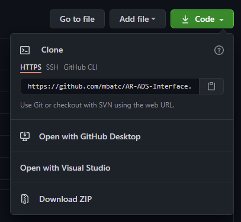
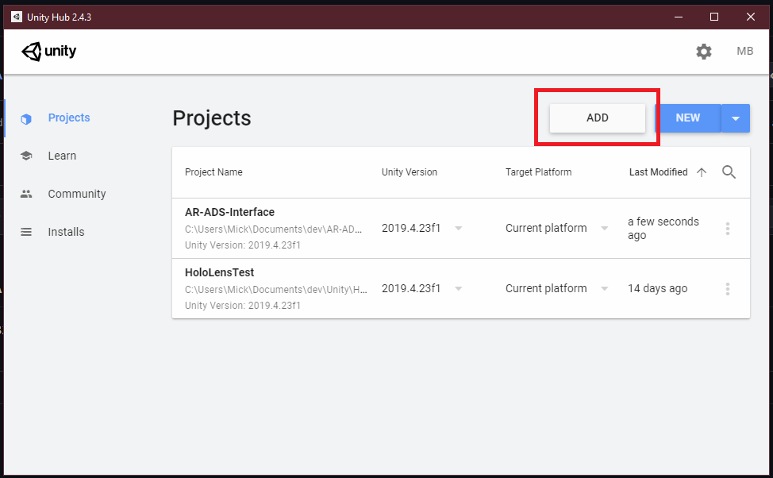
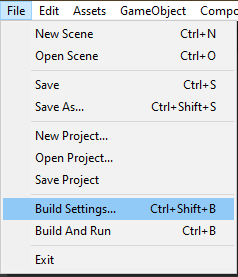
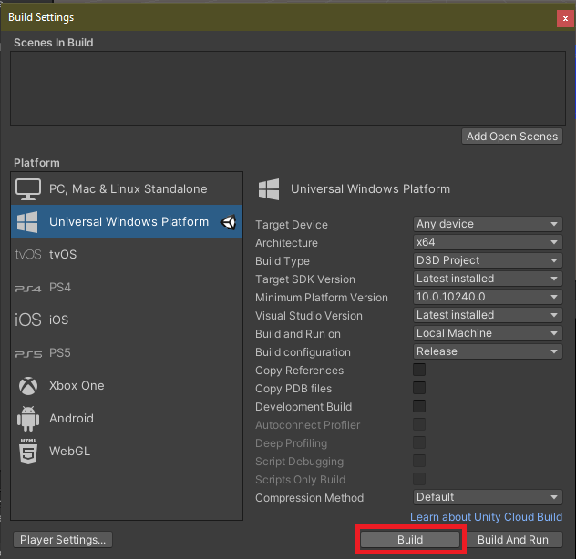
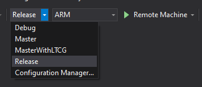
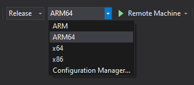

# Augmented Reality Automated Driving System Interface

## About

IFB398 Capstone Project in collaboration with [CARRS-Q](https://research.qut.edu.au/carrsq/)

## Authors

| Name               | Role |
| ------------------ |-|
| Erin Sabransky     | |
| Matthew Civitarese | |
| Brock Billings     | |
| Michael Batchelor  | |

# Requirements

This project is an application that runs on the Microsoft HoloLens and has the following dependencies,

1. [Dot NET 5.0](https://dotnet.microsoft.com/download/dotnet/thank-you/sdk-5.0.201-windows-x64-installer) for C#
2. [Latest Windows 10 SDK](https://developer.microsoft.com/en-us/windows/downloads/windows-10-sdk/)
3. [Visual Studio 2019](https://visualstudio.microsoft.com/downloads/)  
   Install the following components:
   * Desktop development with C++
   * Universal Windows Platform (UWP) development
4. Unity 2019.4.23f1, which can be downloaded [here](https://unity3d.com/get-unity/download/archive)  
   Install the following Platforms:
   * Universal Windows Platform Build Support
   * Windows Build Support (IL2CPP)

# Getting Started

## Project Setup

1. First thing to do is download the project to your PC. You can do this by cloning the repo using a GIT tool, or downloading the project as a ZIP.

   

2. Once you have a local copy, you can now open the project in Unity using Unity Hub. Do this by opening Unity Hub and clicking `Add`, shown below.
   

3. Open the project in Unity 2019.4.23f1

> It is better to place the project in a directory close to the root of your hard drive (e.g. `C:\dev\`). This is because there is a maximum path length on some Windows machines which can cause issues. 

## Build and Deploy the Project

> Before deploying the app, the HoloLens must be in Developer Mode. To enable Developer Mode, follow this [guide](https://docs.microsoft.com/en-us/windows/mixed-reality/develop/platform-capabilities-and-apis/using-visual-studio?tabs=hl2).

1. Open the `Build Settings` window using `File -> Build Settings` in the menu bar.  
   
2. Click `Build` and choose a suitable location to build the project to. This will generate a Visual Studio 2019 Solution file.  
   
3. Open the solution file in Visual Studio 2019.  
4. To configure the solution to be built for the HoloLens, in the configuration options toolbar, select `Release`,  
     
    and `ARM64`  
   
5. Connect the HoloLens to your PC.  
6. Goto `Debug -> Start Without Debugging` to build and deploy the application to the HoloLens.  
